# Wazuh Detection Engineering Lab

A home SOC lab built to answer one question: **what does a default Wazuh install actually catch, and what does it miss?**

I stood up a 4-VM lab on Proxmox (Wazuh manager, a disposable Linux victim, Kali, and a local LLM inference box), then ran real MITRE ATT&CK techniques against the victim using Atomic Red Team. Rather than stopping at "I installed a SIEM," I treated the default ruleset as something to test — found three confirmed detection gaps, diagnosed the root cause of each one, and built two different kinds of working fixes: real-time File Integrity Monitoring for file-based techniques, and a hand-written correlation rule (backed by `auditd`) for a technique with no file footprint at all.

This repo is part of a larger home lab. Infrastructure/network context lives in [Home-Lab](https://github.com/BrandonRoos/Home-Lab); this repo is the deep dive on the detection engineering work specifically.

---

## Table of Contents

- [Findings at a Glance](#findings-at-a-glance)
- [Architecture](#architecture)
- [Phase 1 — Infrastructure Buildout](#phase-1--infrastructure-buildout)
- [Phase 2 — Attack Simulation & Detection Engineering](#phase-2--attack-simulation--detection-engineering)
  - [Finding 1 & 2: T1059.004-1 and T1082-3 — closed by real-time FIM](#test-1-t1059004-1-create-and-execute-bash-shell-script)
  - [Finding 3: T1082-8 — closed by a custom audit-based rule](#test-3-t1082-8-hostname-discovery--closed-by-a-custom-rule)
- [Troubleshooting Notes](#troubleshooting-notes)
- [Key Takeaways](#key-takeaways)
- [What's Next](#whats-next)

---

## Findings at a Glance

| #   | Technique                                          | Initial Result | Root Cause                                                                                                                                                                    | Fix                                                                                                                                    | Validation                                             |
| --- | -------------------------------------------------- | -------------- | ----------------------------------------------------------------------------------------------------------------------------------------------------------------------------- | -------------------------------------------------------------------------------------------------------------------------------------- | ------------------------------------------------------ |
| 1   | T1059.004-1 (Create and Execute Bash Shell Script) | No alert       | `/tmp` wasn't in FIM's monitored directory scope, and even if it had been, the default 12-hour scan interval couldn't catch a file that exists for under a second             | Added real-time (`realtime="yes"`) FIM monitoring on `/tmp`                                                                            | Rule 550 fired on both re-runs                         |
| 2   | T1082-3 (List OS Information)                      | No alert       | Same write-then-delete-in-`/tmp` pattern as Finding 1                                                                                                                         | Closed for free by the Finding 1 fix — no new config change                                                                            | Rule 550 fired, confirmed                              |
| 3   | T1082-8 (Hostname Discovery)                       | No alert       | No file footprint at all to catch; `auditd` wasn't installed; Wazuh wasn't ingesting the audit log; once it was, the only matching rule (80700) is a level-0 silent catch-all | Installed `auditd`, added a kernel-level `execve` rule, wired the audit log into Wazuh, wrote custom rule 100100 inheriting from 80700 | Rule 100100 fired 4/4 times, correctly mapped to T1082 |

Two distinct detection mechanisms validated end-to-end: real-time File Integrity Monitoring for file-based techniques, and an audit-log-based custom correlation rule for a technique with no filesystem footprint at all.

### Repo Structure

```text
wazuh-detection-engineering-lab/
├── README.md
├── LICENSE
└── docs/
    └── images/
        ├── phase1-infrastructure/         # Proxmox → 4-VM build screenshots
        └── phase2-detection-engineering/  # Atomic Red Team test + fix screenshots
```

---

## Architecture

| VM        | Role                                                                     | IP            |
| --------- | ------------------------------------------------------------------------ | ------------- |
| wazuh-aio | Wazuh manager + indexer + dashboard (v4.14.6)                            | 192.168.2.101 |
| victim-01 | Disposable Ubuntu 22.04 attack target, Wazuh agent enrolled              | 192.168.2.102 |
| kali-01   | Attacker/scanning box                                                    | 192.168.2.103 |
| ollama-01 | Local LLM inference (CPU-only), feeds a separate AI log-analysis project | 192.168.2.104 |

Hypervisor: Proxmox VE 9.2.2, on a Lenovo ThinkCentre M710q (4-core/8-thread, 32GB RAM). All lab traffic sits on an isolated 192.168.2.0/24 segment behind pfSense.

_(All IPs shown throughout this repo are private, non-routable RFC1918 addresses — they don't expose anything about the host network.)_

### Tools & Versions

| Component                  | Version / Detail                                                                                         |
| -------------------------- | -------------------------------------------------------------------------------------------------------- |
| Hypervisor                 | Proxmox VE 9.2.2                                                                                         |
| SIEM                       | Wazuh 4.14.6 (all-in-one: manager + indexer + dashboard), upgraded mid-build from 4.9.2                  |
| Victim OS                  | Ubuntu Server 22.04.5                                                                                    |
| Attacker/scanning OS       | Kali 2026.1, updated to current rolling release via `apt full-upgrade`                                   |
| Attack simulation          | Atomic Red Team, via the Invoke-AtomicRedTeam PowerShell Core module                                     |
| Shell environment (victim) | PowerShell Core (`pwsh`) 7.6.3 for Atomic Red Team, plain bash for auditd/syscheck config work           |
| Host auditing              | `auditd` + `audispd-plugins` (installed during Phase 2, not present by default)                          |
| Local LLM inference        | Ollama, CPU-only — `llama3.1:8b` (interactive) and `jimscard/whiterabbit-neo:13b` (overnight batch only) |

---

## Phase 1 — Infrastructure Buildout

Getting four VMs built, networked, and talking to each other correctly. This phase is "the lab exists" — Phase 2 is "the lab does its job."

### Proxmox setup and the enterprise repo error

Proxmox VE 9.2.2 was already installed on the M710q (host `pve01`), with `local` and `local-lvm` storage pools healthy. The first thing I hit was a red "Update package database" task in Proxmox's own task log — `apt-get update` on the host was failing with **401 Unauthorized** errors against `enterprise.proxmox.com` (both the `pve` and `ceph-squid` repos). This is the standard "no paid subscription" issue: Proxmox ships with the enterprise repo enabled by default and it needs a subscription key to authenticate.

My first instinct was to disable it with a `sed` against `/etc/apt/sources.list.d/pve-enterprise.list` — but that file didn't exist. Proxmox VE 9 moved to the newer deb822 `.sources` format, so the actual files were `pve-enterprise.sources` and `ceph.sources`. Simplest fix was to rename both so apt stops reading them:

```bash
mv /etc/apt/sources.list.d/pve-enterprise.sources /etc/apt/sources.list.d/pve-enterprise.sources.disabled
mv /etc/apt/sources.list.d/ceph.sources           /etc/apt/sources.list.d/ceph.sources.disabled
```

Then added a `pve-no-subscription.sources` file pointing at the free `download.proxmox.com` mirror and re-ran `apt-get update` — the 401s were gone. Left the "No valid subscription" nag popup alone; it's cosmetic, appears every login, just click OK.


### BIOS: had to enable virtualization by hand

Created the first VM (Wazuh, VM 100) and it wouldn't start — Proxmox threw `Error: KVM virtualisation con...` on every start attempt. Checked the host and found the root cause:

```console
root@pve01:~# egrep -c '(vmx|svm)' /proc/cpuinfo
0
```

Zero — meaning VT-x wasn't exposed to the host at all, even though it's a hardware feature this CPU supports. That can only be fixed in BIOS, not remotely, so I physically went to the M710q with a monitor and keyboard: into Lenovo BIOS setup (**F1** at boot) → **Advanced → CPU Setup**, and enabled **Intel Virtualization Technology (VT-x)** and **VT-d**. (Worth flagging: this is _not_ the same as "Device Guard" under the Security tab — that's a separate, Windows-specific feature and won't fix KVM.) Saved, exited, rebooted.

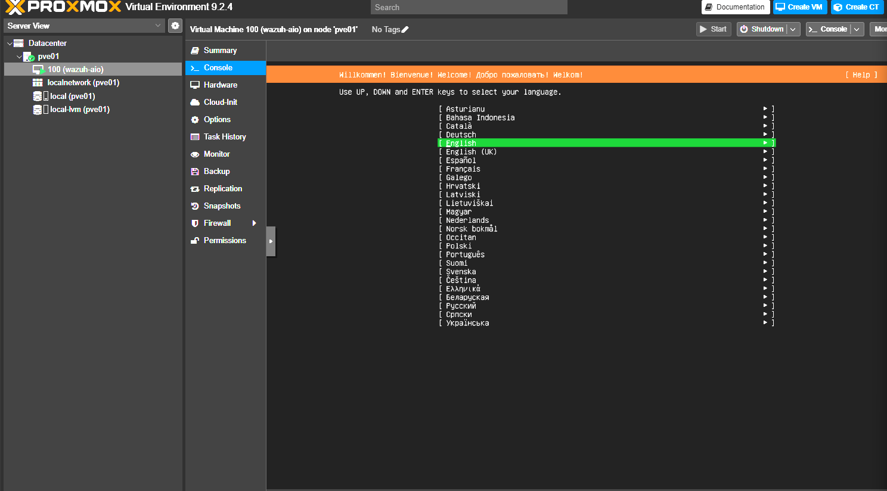

Re-ran the same check — the count that returned `0` before now returned `8`, one per logical thread. VM started cleanly after that:

```console
root@pve01:~# egrep -c '(vmx|svm)' /proc/cpuinfo
8
```

### Wazuh all-in-one install

Ran the official Wazuh install script (`wazuh-install.sh -a` — single node: manager + indexer + dashboard together) on a fresh Ubuntu Server 22.04.5 VM (192.168.2.101, 4 vCPU / 8GB RAM / 70GB disk). It installed clean on the **second** attempt — the first had a copy-paste typo (`-a~` instead of `-a`) that threw an "Unknown option" error, no real harm. Logged into the dashboard at `https://192.168.2.101` with the generated admin credentials. Version installed was **4.9.2** — which matters in a second.

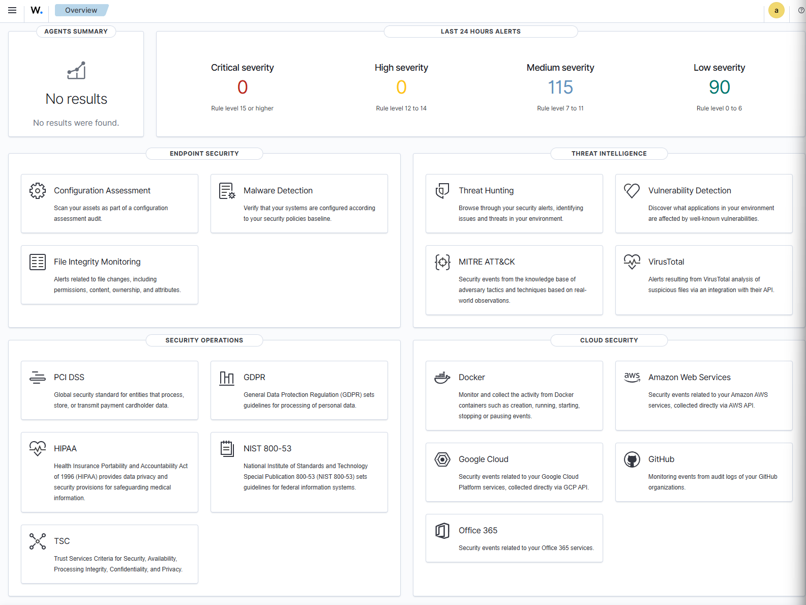

### Agent enrollment — a version mismatch

Built the victim VM (192.168.2.102, Ubuntu Server 22.04, 2 vCPU / 4GB / 35GB) as a disposable attack target, installed the Wazuh agent, pointed it at the manager, and started the service. Locally it looked healthy — `active (running)`, all subprocesses up — but it never appeared in the dashboard's Agents Summary.

The real error was in `/var/ossec/logs/ossec.log` on the victim:

> Agent version must be lower or equal to manager version

The agent repo had installed the latest agent (**4.14.6**) against a manager still on **4.9.2**, and an agent can't be newer than its manager. Rather than downgrade the agent, I upgraded the whole manager stack — better long-term than pinning to an old version. Took a Proxmox snapshot of the Wazuh VM first as a safety net, then upgraded every Wazuh component together (not just the manager, to avoid internal mismatches between Wazuh's own pieces):

```bash
apt install --only-upgrade wazuh-manager wazuh-indexer wazuh-dashboard filebeat
```


### Post-upgrade cert filename mismatch

The upgrade then broke the dashboard in a new way: `wazuh-dashboard` was stuck in a restart loop (systemd restart counter climbing into the 80s) and port 443 wasn't listening at all — even though `systemctl status` cheerfully reported "active." The real crash reason was in `journalctl -u wazuh-dashboard`:

> Error: ENOENT: no such file or directory, open '/etc/wazuh-dashboard/certs/dashboard-key.pem'

The existing cert files were named `wazuh-dashboard-key.pem` / `wazuh-dashboard.pem` (from the original 4.9.2 install), but the upgraded 4.14.6 config (`opensearch_dashboards.yml`) expected them as `dashboard-key.pem` / `dashboard.pem` — a filename convention that changed between versions. I fixed it by symlinking the existing certs to the new expected names rather than renaming, so nothing else still referencing the old names would break:

```bash
ln -s wazuh-dashboard-key.pem dashboard-key.pem
ln -s wazuh-dashboard.pem     dashboard.pem
```

Restarted the dashboard — clean, listening on 443, reachable again. Restarted the agent on the victim now that manager and agent were both on 4.14.6, and the dashboard finally showed **Agents Summary: Active (1)**. Full loop working — manager, indexer, dashboard, and a live enrolled endpoint all talking.


### A thin-pool warning that turned out to be a non-issue

While taking that pre-upgrade snapshot, Proxmox warned that allocated (virtual) disk sizes across all VMs summed to ~191GB against a thin pool reporting only ~16GB free. Instead of reacting to it, I checked actual usage with `lvs` — real physical utilization was only ~29% of the 141GB pool. So this was thin-provisioning overcommit working exactly as designed, not an active problem. Flagged it to watch as more VMs and Wazuh indexer logs accumulate, and moved on. Worth including precisely because the correct call was _not_ to "fix" anything.

### Kali and Ollama VMs

**Kali** (VM 102, 192.168.2.103, 4 vCPU / 4GB / 50GB): built from the Kali 2026.1 ISO. The current release was actually 2026.2 (out a few days earlier), but I'd already started the 2026.1 download — it's a rolling release, so it doesn't matter, and `apt full-upgrade` brings it current anyway. Installer flow was basically identical to the Ubuntu Server builds (hostname, user, guided partitioning on the whole disk, GRUB to `/dev/vda`). Ran `apt update && apt full-upgrade -y` on first boot to roll it current — this took a _long_ time, since Kali bundles a huge tool catalog compared to a bare Ubuntu Server box. One gotcha: SSH wasn't enabled by default the way it was on the Ubuntu images, so I turned it on by hand:

```bash
systemctl enable ssh && systemctl start ssh
```

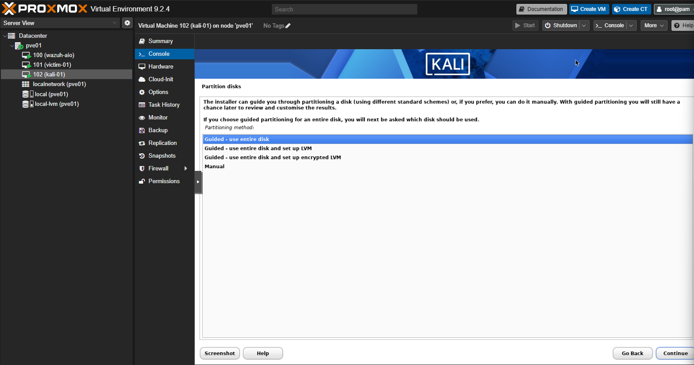

**Ollama** (VM 103, 192.168.2.104): initially configured with 6 vCPU, and Proxmox refused to start it — `Error: MAX 4 vcpus allowed`. The M710q's CPU physically has only 4 cores (8 threads via hyperthreading), and Proxmox won't let a VM using CPU type `host` request more cores than the physical chip has. Dropped it to 4 cores and it started fine.

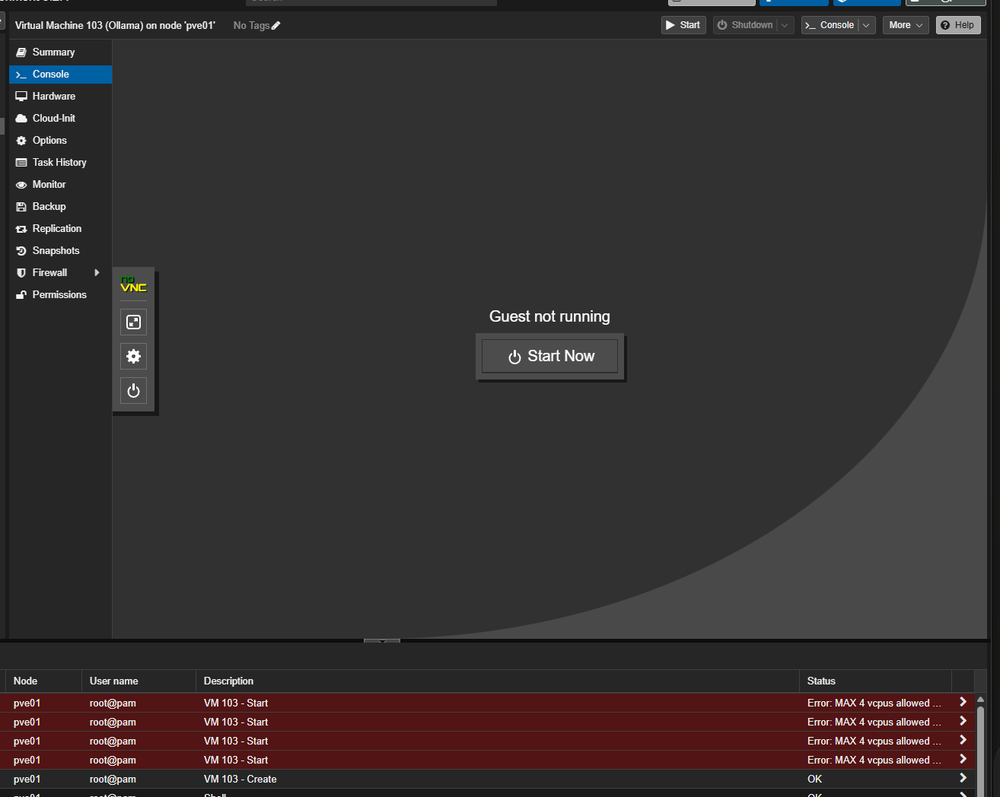

That ceiling drove a deliberate architecture decision instead of trying to brute-force more resources than the hardware has: **Wazuh + victim stay always-on** as the baseline detection stack (light actual load most of the time), while **Kali and Ollama run on-demand only**. Ollama's VM is set to auto-start with the host (`qm set 103 --onboot 1`) since the plan is scheduled/unattended overnight analysis jobs rather than interactive chat — which also sidesteps the CPU-only speed problem, since latency doesn't matter for an unattended job. Installed Ollama via its official script and got the expected `No NVIDIA/AMD GPU detected, Ollama will run in CPU-only mode` warning, confirming what I already knew about this box.

**A disk-sizing bug that ate an overnight model pull:** the Ollama VM's Ubuntu installer only allocated 24GB of the 50GB disk to the root LV. That's almost certainly why an unattended `llama3.1:8b` pull silently stalled overnight — I'd run it directly in an SSH session with no `tmux`/`nohup`, so it likely died when the session dropped, compounded by space pressure. Fixed the disk by extending the root LV to fill it (`lvextend -l +100%FREE`) and growing the filesystem (`resize2fs`), then re-ran the pull inside `tmux` specifically so it could survive a disconnect. It did: I got dropped mid-download, reconnected, `tmux attach` picked it right back up with zero loss. `llama3.1:8b` pulled and tested live with an accurate MITRE ATT&CK answer — genuinely usable despite CPU-only inference.

### Open WebUI and a real hardware ceiling

Installed Docker (`docker.io`) and the official Open WebUI container, pointed at the local Ollama endpoint (`http://127.0.0.1:11434`). Reachable at `http://192.168.2.104:8080`, created the admin account, and both models showed up correctly in the selector: `llama3.1:8b` and `jimscard/whiterabbit-neo:13b` (a community GGUF conversion of WhiteRabbitNeo-13B — the plain `whiterabbitneo` tag doesn't exist in Ollama's official library).

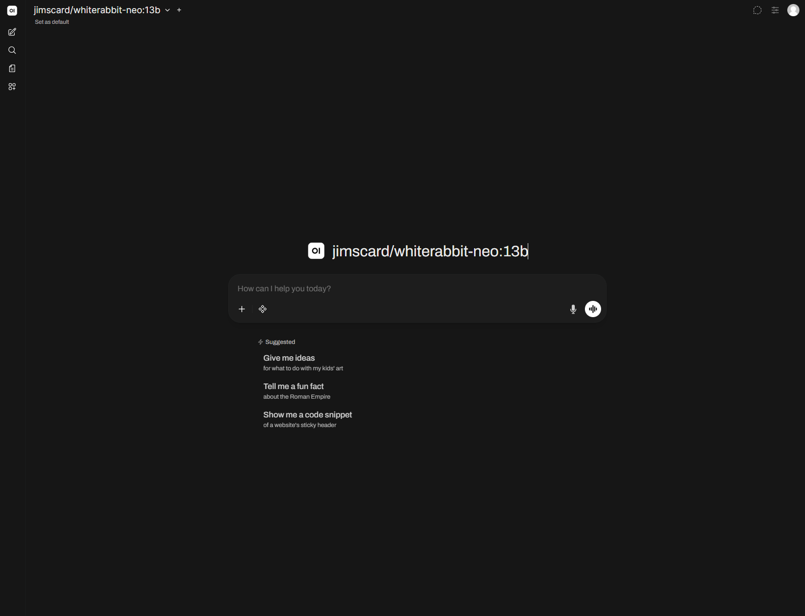
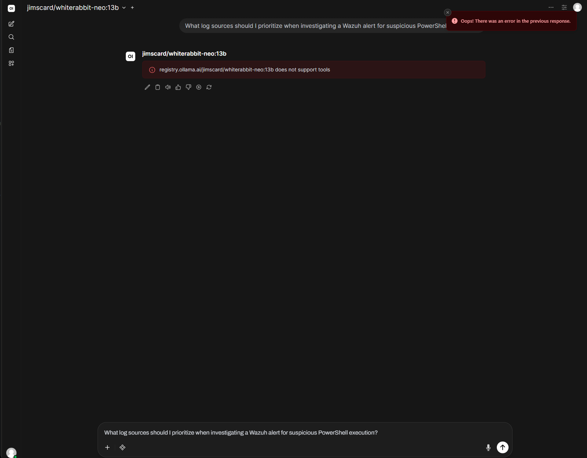

Then the hardware ceiling showed up as a hard number. Testing `jimscard/whiterabbit-neo:13b` (the 13B security-focused model) with a real question through Open WebUI errored out — _"Oops! There was an error in the previous response."_ The Ollama service logs showed it wasn't crashing, just far too slow: **114 seconds of prompt processing alone (4.49 tokens/sec)**, with token generation running at **~2 tokens/sec**. Open WebUI's request timeout fired long before the model could finish. This is the CPU-only ceiling I'd expected, now a concrete measured number instead of a theoretical concern.

**Decision:** keep `jimscard/whiterabbit-neo:13b` strictly as an overnight/unattended batch-job model on this box, and use the smaller, meaningfully faster `llama3.1:8b` for anything interactive. The GPU-acceleration follow-up spun out into its own separate project rather than being allowed to block this lab.

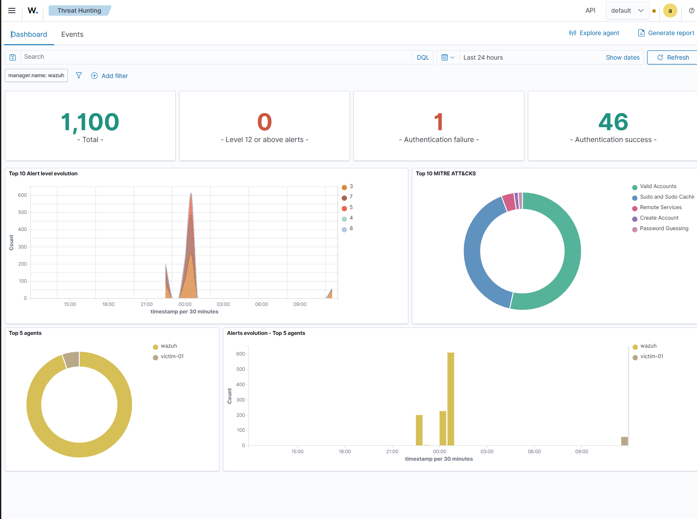
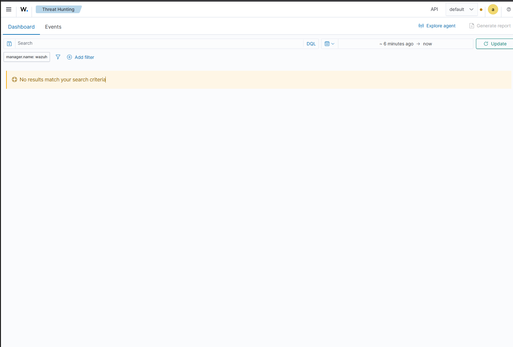

---

## Phase 2 — Attack Simulation & Detection Engineering

Infrastructure existing isn't the same as the lab doing its job. This phase is where I actually tested the default Wazuh ruleset against real MITRE ATT&CK techniques using Atomic Red Team, and treated every miss as a diagnostic exercise rather than a dead end.

### Setting up the test

`Invoke-AtomicTest T1059 -ShowDetailsBrief` returned `Found 0 atomic tests applicable to linux platform` for the bare parent technique — so I dropped down to the Linux-specific sub-technique **T1059.004 (Unix Shell)**, which has 17 available tests. (That "zero results" is a good first lesson: a parent technique having no Linux atomics is easy to mistake for a tooling problem when it's really just how Atomic Red Team is organized.)

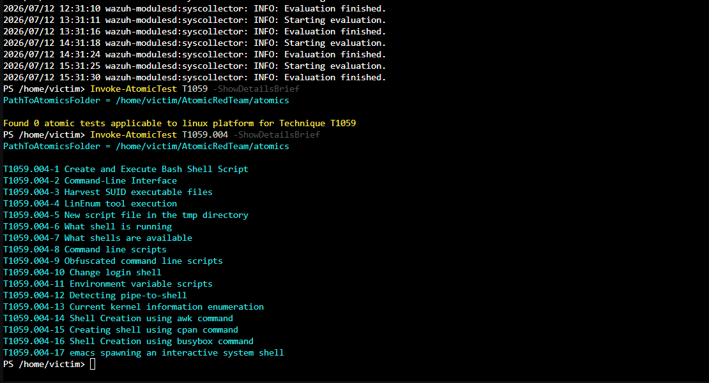

### Test 1: T1059.004-1 (Create and Execute Bash Shell Script)

`Invoke-AtomicTest T1059.004 -TestNumbers 1` writes a bash script to disk, executes it (it also fires a benign `ping 8.8.8.8` from inside the script), and cleans up after itself. Exit code 0.


**Investigating whether anything fired took a few wrong turns worth documenting, because the process matters as much as the result:**

- Baseline dashboard state, for reference:
  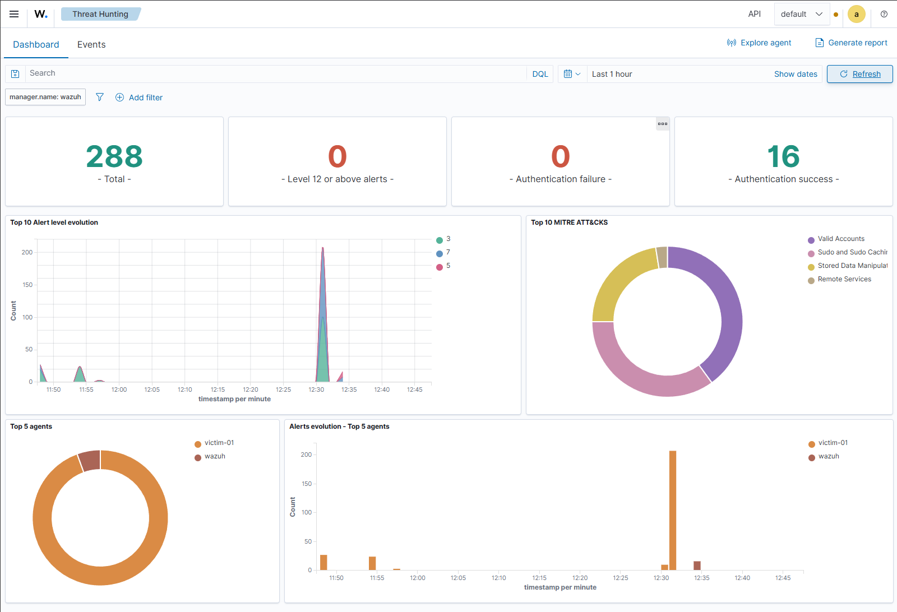
- A wide "last 1 hour" search showed 217 hits mapped to a MITRE category of "Stored Data Manipulation" — looked promising, but was a red herring:
  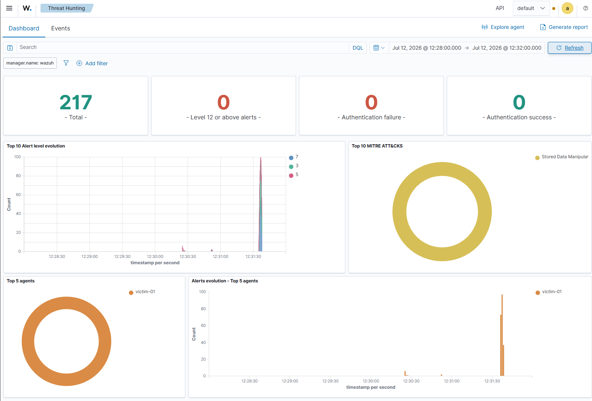
- Those 217 hits were all **CIS Ubuntu 22.04 LTS Benchmark SCA checks** (rule IDs 19007 / 19008 / 19009) — Wazuh's periodic config-compliance scanner running on its own independent schedule, completely unrelated to the test. That's almost certainly what got mislabeled "Stored Data Manipulation" in the dashboard's MITRE donut. Lesson: the MITRE ATT&CK category label shouldn't be trusted at face value — always check the actual `rule.description`.
  
- Narrowing the time window surfaced a real gotcha in the dashboard's Absolute date picker — it wants `Jul 12, 2026 @ 12:28:00.000` and rejects ISO format (`2026-07-12 12:28:00.000`):
  
- Filtering for `.sh` narrowed to 2 hits, both **rule 510** ("Host-based anomaly detection event — rootcheck"), level 7, timestamped 12:30:52 — right in the test window, so it looked real. It wasn't: rootcheck's generic trojan-signature scanner had flagged `/usr/bin/diff` (a completely unrelated system binary) because its contents matched a broad "Generic" signature pattern (`bash|^/bin/sh|file\.h|/proc\.h|/dev/[^n]|^/bin/.*sh`). Plenty of legitimate binaries contain those strings — a known false-positive-prone check, coincidental timing only:
  
  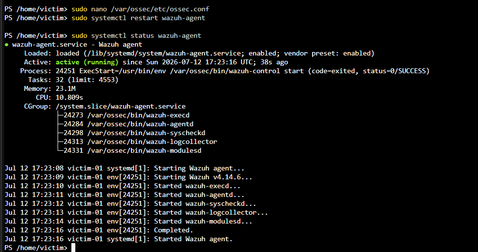
- Searching `/tmp` directly returned **zero results** — confirming FIM wasn't monitoring the directory Atomic Red Team actually staged its script in:
  

**Root cause, once actually diagnosed:** two-part. `/tmp` wasn't in Wazuh's monitored directory list at all (default syscheck scope: `/etc`, `/usr/bin`, `/usr/sbin`, `/bin`, `/sbin`, `/boot`). And even if it had been in scope, it wouldn't have mattered — Wazuh's default FIM scan runs every 12 hours (`<frequency>43200</frequency>`), and Atomic Red Team's own `cleanup_command` (`rm #{script_path}`) deletes the script within about a second of creating it. A file that exists for under a second between 12-hour scans is invisible to periodic FIM by design, regardless of directory scope.

**Fix:** added a dedicated real-time-monitored directory entry to `ossec.conf`, kept separate from the periodic-scan directories (only fast-changing staging areas like `/tmp` need the real-time overhead):

```xml
<directories realtime="yes">/tmp</directories>
```

Restarted the agent and confirmed via `ossec.log` that syscheckd registered it: `Directory set for real time monitoring: '/tmp'`.


**Validation:** re-ran the exact same test twice back-to-back. Both runs caught cleanly by **rule 550** ("Integrity checksum changed") on `/tmp/art.sh`:

| Time                        | Path        | Action   | Rule                             | Level |
| --------------------------- | ----------- | -------- | -------------------------------- | ----- |
| Jul 12, 2026 @ 15:37:05.584 | /tmp/art.sh | modified | 550 (Integrity checksum changed) | 7     |
| Jul 12, 2026 @ 15:37:58.325 | /tmp/art.sh | modified | 550 (Integrity checksum changed) | 7     |

Bonus catch: it also picked up `/tmp/Invoke-AtomicTest-ExecutionLog.csv` (Atomic Red Team's own run-tracking log) modifying on both runs — a useful secondary artifact that confirms the real-time watch is broad-spectrum on the directory, not narrowly tuned to one filename.


**Where I went wrong looking for it (so I don't repeat it):** I spent a while convinced the fix was still broken when it was actually already working. Two causes, both worth remembering:

- **Timezone mismatch, twice over.** `ossec.log` timestamps are always UTC, and I was reading them as local — a several-hour skew that made the config change look like it had happened long before my test run. On top of that, victim-01's system clock was on plain `Etc/UTC` with no timezone set at all, so terminal times and the dashboard's local-time display didn't line up until I fixed it explicitly:
  ```bash
  sudo timedatectl set-timezone America/New_York
  sudo timedatectl set-ntp true
  ```
  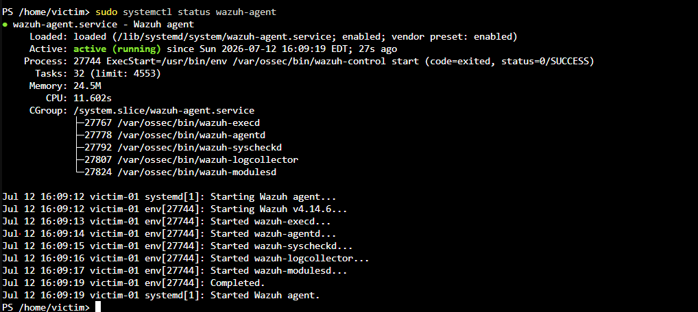
- **Searched the wrong tool for the data.** After the fix I kept using the free-text **Threat Hunting → Events** search bar with a plain `.sh` query and got zero results, even over a 24-hour window — which looked like total failure. The actual catches were sitting the whole time in a different, purpose-built view: **Endpoints → victim-01 → FIM: Recent events**, which queries the syscheck event data directly instead of doing a generic text match against the full alert corpus. Lesson for next time: when hunting FIM/syscheck hits, go straight to the FIM panel (or filter on `rule.groups: syscheck`) rather than a loose free-text search.

### Test 2: T1082-3 (List OS Information) — closed for free

Before building anything new for T1082-3, I checked whether the real-time FIM fix from T1059.004-1 already covered it — because the two share a behavioral pattern. `Invoke-AtomicTest T1082 -ShowDetailsBrief` confirmed test 3 ("List OS Information") runs:

```bash
uname -a >> /tmp/T1082.txt
cat /etc/lsb-release >> /tmp/T1082.txt   # if present
uptime >> /tmp/T1082.txt
cat /tmp/T1082.txt
rm /tmp/T1082.txt                        # cleanup
```

Same shape as T1059.004-1: write to `/tmp`, do the work, delete quickly. So I re-ran it with the existing fix in place — no new config change — and it was caught immediately by the same **rule 550** (`/tmp/T1082.txt` modified, Jul 12 @ 15:55:06.851, level 7). **One well-placed control closed two separate ATT&CK techniques' worth of blind spot** — not because they're related techniques, but because they share the same underlying write-then-delete-in-`/tmp` behavior. That's the kind of leverage worth looking for rather than writing a bespoke rule per technique.

I considered building a dedicated `auditd` rule for this one too, but decided against it — `uname`, `cat`, and `uptime` are extremely common, legitimate utilities that run constantly during normal operation; a rule watching those binaries directly would be noisy junk in any real environment. The FIM fix was the right-sized control here. (The interesting detections are behavioral correlations, not naive "alert on this binary running" rules — a design principle I'm carrying forward.)

### Test 3: T1082-8 (Hostname Discovery) — closed by a custom rule

This is the real custom-detection milestone — the first gap that required actually understanding Wazuh's decoder/rule pipeline rather than just expanding FIM scope. T1082-8 runs a bare `hostname` command — no file writes, no cleanup artifact, nothing for FIM to ever catch. Confirmed a clean, total gap (zero hits anywhere in Threat Hunting) before building anything.

Built in stages, each one diagnosed before moving to the next:

1. **auditd wasn't installed at all.** Installed it fresh on victim-01:
   ```bash
   sudo apt install auditd audispd-plugins -y
   sudo systemctl enable --now auditd
   ```
2. **Added a kernel-level audit rule** watching `execve` calls to `/usr/bin/hostname`, tagged with a key for easy filtering. Appended to `/etc/audit/rules.d/audit.rules`:
   ```text
   -a always,exit -F arch=b64 -S execve -F path=/usr/bin/hostname -k t1082_recon
   ```
   Loaded with `sudo augenrules --load` and confirmed active with `sudo auditctl -l`.
   
3. **Confirmed the rule worked locally, independent of Wazuh** — ran the test, then `sudo ausearch -k t1082_recon` on victim-01. Clean EXECVE records: `exe="/usr/bin/hostname"`, `comm="hostname"`, `success=yes`. Kernel-level auditing was solid, so the gap was entirely on the Wazuh ingestion/rule side.
4. **Wazuh wasn't reading the audit log at all** — `ossec.conf` had zero reference to it. Added a `<localfile>` block:
   ```xml
   <localfile>
     <log_format>audit</log_format>
     <location>/var/log/audit/audit.log</location>
   </localfile>
   ```
   Restarted the agent and confirmed via `ossec.log` that `wazuh-logcollector` started `Analyzing file: '/var/log/audit/audit.log'`.
5. **Still nothing on the dashboard.** Used `wazuh-logtest` on the manager to diagnose exactly why, feeding it a raw EXECVE line from `ausearch`. The phase-by-phase breakdown was the key: decoding _succeeded_ — Wazuh correctly parsed `audit.execve.a0: 'hostname'` — but the only rule that matched was the generic built-in rule **80700** ("Audit: Messages grouped"), which is **level 0**: logged internally, never alerted. Not a broken pipeline at all — audit events were being intentionally bucketed into a silent catch-all unless something more specific overrode it.
6. **Wrote a custom rule** in `/var/ossec/etc/rules/local_rules.xml` on the manager, inheriting from 80700 and matching on the field Wazuh had already extracted:
   ```xml
   <group name="local,audit,t1082,discovery,">
     <rule id="100100" level="5">
       <if_sid>80700</if_sid>
       <field name="audit.execve.a0">hostname</field>
       <description>T1082 - System Information Discovery: hostname command executed (audit)</description>
       <mitre>
         <id>T1082</id>
       </mitre>
     </rule>
   </group>
   ```
   Restarted `wazuh-manager` to reload the ruleset.
   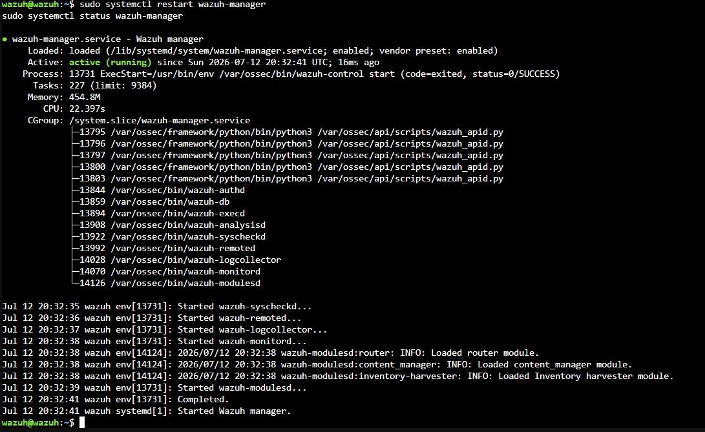

**Validation:** re-ran `Invoke-AtomicTest T1082 -TestNumbers 8`. Confirmed **4 hits in Threat Hunting, all rule 100100, level 5**, description exactly as written, correctly mapped to T1082. Clean, working, custom-built detection.


---

## Troubleshooting Notes

Smaller issues hit along the way, kept separate from the main narrative since they're operational friction rather than detection findings — but worth recording exactly as they happened.

**PowerShell module not persisting across sessions.** Every time I opened a fresh `pwsh` session on victim-01, `Invoke-AtomicTest` came back as "command not found" — the Invoke-AtomicRedTeam module doesn't auto-load. Had to re-import it manually each time:

```powershell
Import-Module "$env:HOME/AtomicRedTeam/invoke-atomicredteam/Invoke-AtomicRedTeam.psd1" -Force
```

Worth fixing properly by adding this line to the PowerShell profile (`$PROFILE`) on victim-01 rather than re-typing it every session — didn't get to it during this pass.

**`wazuh-logtest` is manager-side only.** Tried running it on victim-01 first and got a plain "command not found." It only exists on the Wazuh manager (`/var/ossec/bin/wazuh-logtest`) — makes sense in hindsight, since rule/decoder evaluation is a manager-side function, but cost a few minutes of confusion before SSHing into the right host.

**Dashboard module filters silently hide relevant events.** Twice, a filter I didn't add manually made a real detection look like a total miss:

- Landing in the **MITRE ATT&CK** module view carries a hardcoded `rule.mitre.id: exists` filter, which hides any event that hasn't been mapped to a MITRE technique yet — including raw, unmapped audit events that were exactly what I was looking for.
- Landing in the **File Integrity Monitoring** module view carries a hardcoded `rule.groups: syscheck` filter, which will never surface an audit-log hit no matter what you search, since it's scoped to FIM events only.

  Lesson: for an open, unfiltered search, use the general **Threat Hunting** module, not a specialized module view — the specialized views are convenient exactly because they're pre-filtered, which is also exactly what makes them the wrong place to look when you're not sure what you're looking for yet.

**The Absolute time-range picker's date format is stricter than it looks.** It rejects standard ISO format (`2026-07-12 12:28:00.000`) with only a small red hint below the field — it wants `Jul 12, 2026 @ 12:28:00.000` specifically (month abbreviation, comma, `@` symbol). Came up more than once before it stuck.

**Timezone drift cost real debugging time twice over.** `ossec.log` timestamps are always UTC regardless of what the dashboard displays — reading them as local time made a working config change look like it predated my test run by hours. Separately, victim-01's actual system clock had no timezone set at all (`Etc/UTC`), which meant terminal timestamps and the dashboard's local-time rendering didn't agree until I explicitly set both timezone and NTP sync:

```bash
sudo timedatectl set-timezone America/New_York
sudo timedatectl set-ntp true
```

Both issues stacked on top of each other during the T1059.004-1 validation, and together made an already-working fix look broken for longer than it should have.

## Key Takeaways

- **A default Wazuh install misses a lot out of the box.** All three techniques tested here — one file-write technique twice over, one command-only technique — went undetected until something was actually built.
- **Two distinct detection engineering patterns, proven against real telemetry:** real-time File Integrity Monitoring for file-based techniques, and audit-log-based correlation rules (with a custom rule inheriting from a decoder) for techniques with no filesystem footprint.
- **"Wazuh sees nothing" and "Wazuh sees it but doesn't alert" are different findings.** Diagnosing from the kernel outward is what told them apart: `ausearch -k <key>` confirms the audit layer is generating events independent of Wazuh, and `wazuh-logtest` (manager-side) breaks a raw log line down pre-decoding → decoding → rule filtering. Default rulesets often bucket unrecognized-but-parsed events into silent, level-0 catch-all rules (like 80700); a real gap analysis has to check for that specifically, not just look for "zero hits."
- **Good detections are behavioral, not binary-name watchlists.** I deliberately did _not_ write an auditd rule for `uname`/`cat`/`uptime` — those run constantly and a rule on them would be pure noise. The valuable detections are correlations (a recon command with no legitimate context, a write to a staging path), not "alert whenever this binary runs."
- **False leads are part of the job, not a detour from it.** Two separate false positives (a coincidental compliance-scan spike, a generic trojan-signature rootcheck hit) came up during this work and both had to be ruled out with evidence before concluding a technique was actually undetected — as did two self-inflicted analysis mistakes (a timezone skew and searching the wrong dashboard view) that made a working fix look broken.

## What's Next

- **pfSense firewall rules** between the lab VLAN and management access — scoped in the original plan, not yet tightened this pass
- Additional technique coverage — deliberately testing something that _doesn't_ write to `/tmp` next (e.g. T1003 credential dumping), to force a gap the FIM fix can't cover for free, plus more T1059.004 sub-tests
- Noise / false-positive tuning as the agents run longer
- Feeds a separate AI-assisted log analysis / SOC assistant project, using this lab's real Wazuh API output rather than sample data
