<div align="center">

# 🛡️ Wazuh Detection Engineering Lab

### Attack Simulation · Detection Gaps · Validated Fixes

A hands-on SOC lab that tests what a default Wazuh deployment catches, traces why expected alerts are missing, and adds validated controls for confirmed gaps.

<br>


</div>

<br>

This is not just an installation walkthrough. It records attack simulation, telemetry analysis, false leads, root-cause work, detection changes, and validation.

I found three confirmed detection gaps and built two kinds of fixes: real-time File Integrity Monitoring and a hand-written correlation rule backed by `auditd`.

> **📖 Start here:** Read the [full chronological build notes](docs/full-build-notes.md) for the complete record of what broke, what I tried, how I diagnosed it, and how I validated each fix.

> **⚙️ Want to deploy it?** The [`configs/`](configs/README.md) directory has the reusable snippets and a copy-paste apply-and-validate guide.

---

## 🎯 Quick view

This project demonstrates:

- Wazuh manager, indexer, dashboard, and Linux agent deployment
- Linux telemetry collection with FIM and `auditd`
- Atomic Red Team testing mapped to MITRE ATT&CK
- Custom Wazuh XML rule development and validation
- Root-cause analysis across endpoint, collector, decoder, rule, and dashboard layers
- False-positive analysis and evidence-based troubleshooting
- Proxmox virtualization, Linux administration, and resource planning
- Clear technical documentation built from real session notes

| Area | Evidence in this repository |
| --- | --- |
| Detection testing | Three simulated behaviors tested before and after changes |
| Root-cause analysis | Missing FIM scope, periodic scan timing, audit ingestion, and silent rule 80700 diagnosed |
| Detection engineering | Real-time FIM plus custom rule 100100 |
| Validation | Exact tests re-run and resulting Wazuh rules documented |
| Reproducibility | Deployable configuration examples under [`configs/`](configs/) |
| Communication | Executive summary here and a detailed chronological engineering log |

---

## 🧭 Navigation

- [Architecture](#architecture)
- [Three techniques closed](#three-techniques-closed)
- [Case study 1: short-lived shell artifact](#case-study-1-short-lived-shell-artifact)
- [Case study 2: one control, another detection](#case-study-2-one-control-another-detection)
- [Case study 3: audit-based custom rule](#case-study-3-audit-based-custom-rule)
- [Troubleshooting highlights](#troubleshooting-highlights)
- [Reproduce the controls](#reproduce-the-controls)
- [Limitations](#limitations)
- [What's next](#whats-next)
- [Full build notes](docs/full-build-notes.md)

## 🗂️ Repository map

```text
wazuh-detection-engineering-lab/
├── README.md
├── configs/
│   ├── README.md
│   ├── auditd/
│   │   └── t1082-hostname.rules
│   └── wazuh/
│       ├── agent-audit-log.xml
│       ├── agent-fim.xml
│       └── local_rules.xml
└── docs/
    ├── full-build-notes.md
    └── images/
        ├── phase1-infrastructure/
        └── phase2-detection-engineering/
```

---

<a id="architecture"></a>

## 🖥️ Architecture

| VM | Role | Resources / detail | Address |
| --- | --- | --- | --- |
| `wazuh-aio` | Wazuh manager, indexer, and dashboard | Wazuh 4.14.6 | `192.168.2.101` |
| `victim-01` | Disposable Linux target and Wazuh agent | Ubuntu Server 22.04 | `192.168.2.102` |
| `kali-01` | Attacker and scanning box | Kali rolling release | `192.168.2.103` |
| `ollama-01` | Local LLM inference | CPU-only Ollama | `192.168.2.104` |

The host is a Lenovo ThinkCentre M710q with 32 GB RAM. The build started on Proxmox VE 9.2.2; later UI captures show 9.2.4 after host updates.

Lab traffic uses an isolated `192.168.2.0/24` segment behind pfSense.

The addresses are private and non-routable. They are included for topology clarity, although they still reveal the lab's internal addressing plan.

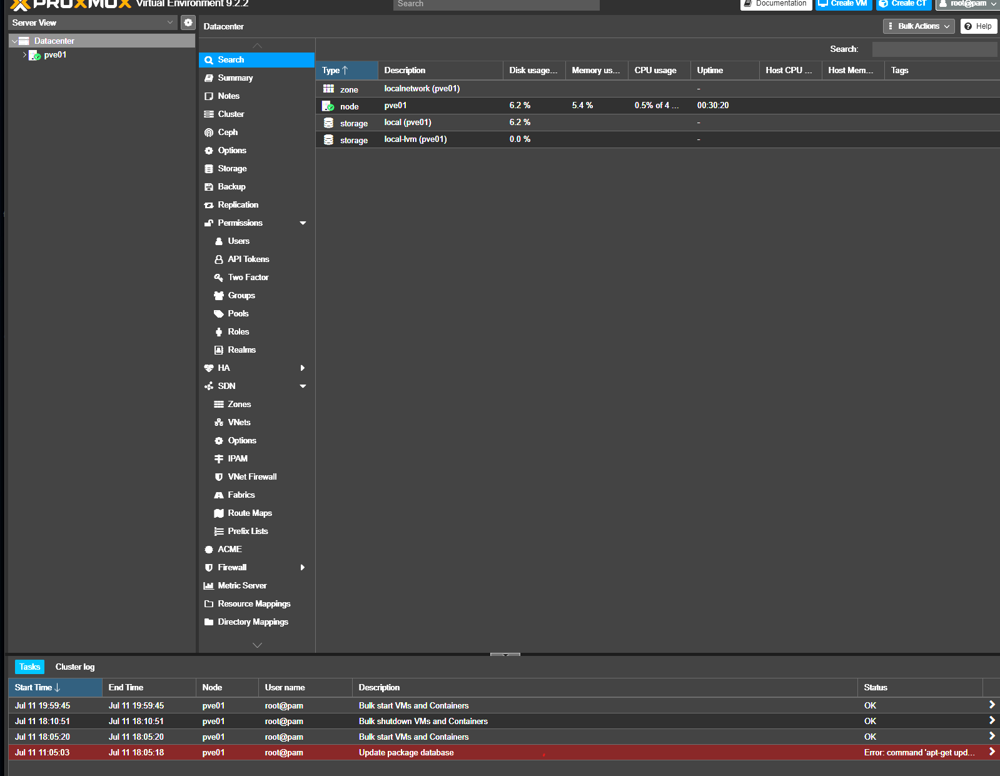

## 🧰 Tools and versions

| Component | Version or detail |
| --- | --- |
| Hypervisor | Proxmox VE 9.2.2 |
| SIEM | Wazuh 4.14.6, upgraded from 4.9.2 |
| Victim | Ubuntu Server 22.04.5 |
| Attack simulation | Atomic Red Team through Invoke-AtomicRedTeam |
| Linux auditing | `auditd` and `audispd-plugins` |
| Test shell | PowerShell Core 7.6.3 and Bash |
| Local inference | Ollama with `llama3.1:8b` and `jimscard/whiterabbit-neo:13b` |

<a id="three-techniques-closed"></a>

## ✅ Three techniques closed

| # | Technique / test | Initial result | Change | Validation |
| --- | --- | --- | --- | --- |
| 1 | T1059.004-1 — Create and Execute Bash Shell Script | No relevant alert | Added real-time FIM on `/tmp` | Rule 550 fired on two re-runs |
| 2 | T1082-3 — List OS Information | No relevant alert | Reused the same real-time FIM control | Rule 550 fired on `/tmp/T1082.txt` |
| 3 | T1082-8 — Hostname Discovery | No alert | Added `auditd`, audit-log ingestion, and rule 100100 | Rule 100100 fired four times |

The work produced two validated detection paths: real-time FIM for fast file activity and an audit-backed custom correlation rule for activity with no file artifact.

To deploy these controls yourself, see the copy-paste apply-and-validate guide in [`configs/README.md`](configs/README.md).

---

<a id="case-study-1-short-lived-shell-artifact"></a>

## 🔬 Case study 1: short-lived shell artifact

### Test

I ran Atomic Red Team test `T1059.004-1`. It writes `/tmp/art.sh`, executes it, and removes it during cleanup.

```powershell
Invoke-AtomicTest T1059.004 -TestNumbers 1
```

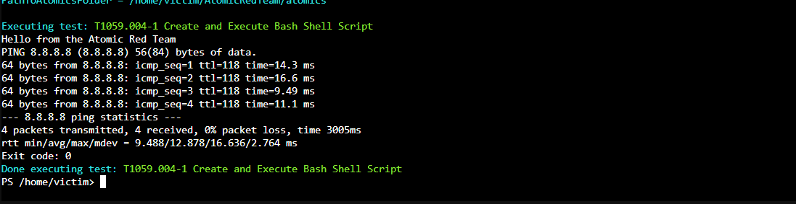

### Initial result

The command succeeded, but I found no relevant Wazuh alert.

A wide search showed 217 events labeled as Stored Data Manipulation. Document inspection showed they were scheduled CIS benchmark checks, not evidence from the test.

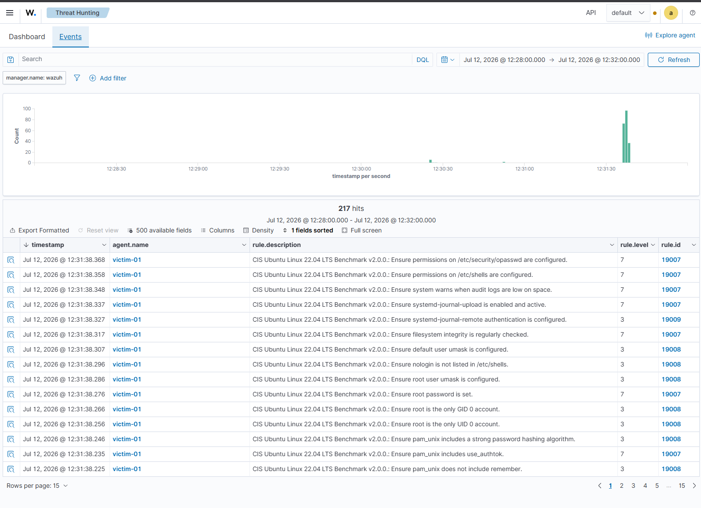

Two rule 510 events appeared in the test window. Their detail identified `/usr/bin/diff` and a broad rootcheck signature, so their timing was coincidental.

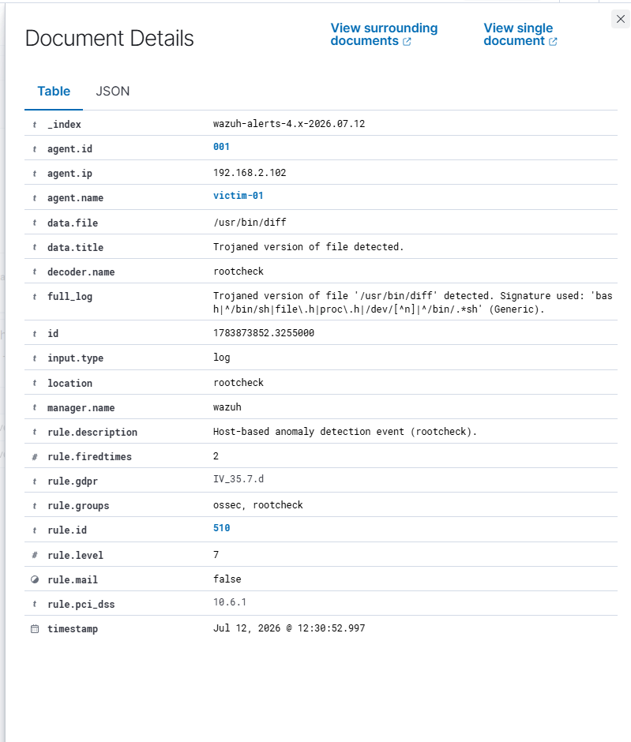

A direct `/tmp` search returned no results.

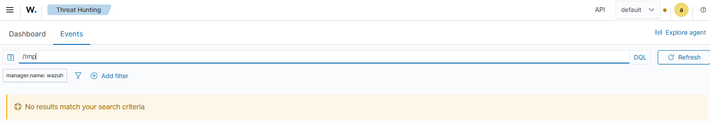

### Root cause

The default `syscheck` scope did not include `/tmp`. Its periodic scan frequency was also 43,200 seconds, while the Atomic test created and removed the script in about one second.

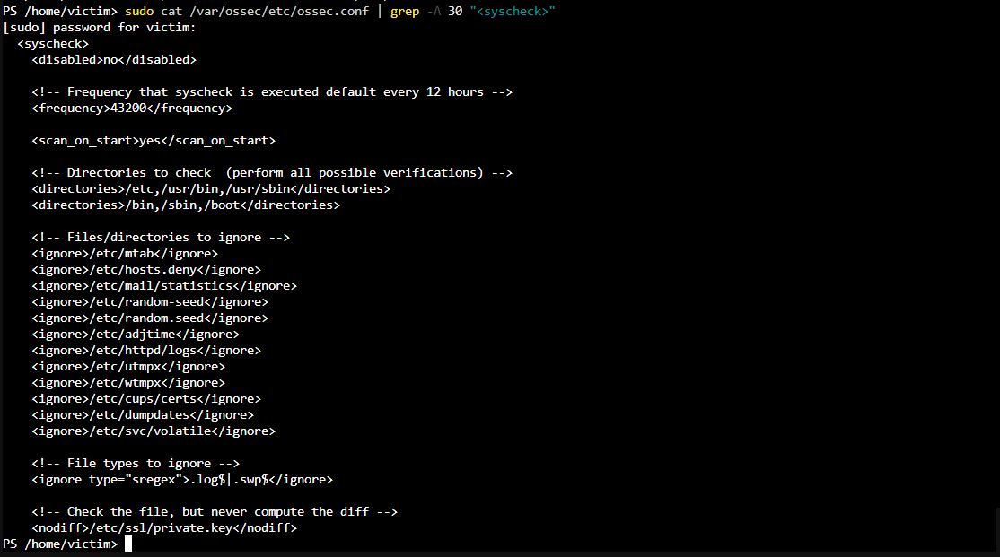

### Fix

I added a separate real-time FIM entry instead of changing every default directory to real-time monitoring.

```xml
<directories realtime="yes">/tmp</directories>
```

The reusable fragment is in [`configs/wazuh/agent-fim.xml`](configs/wazuh/agent-fim.xml).

### Validation

I restarted the agent and ran the same Atomic test twice. Both runs produced rule 550 events for `/tmp/art.sh`.

| Time | Path | Rule | Level |
| --- | --- | --- | --- |
| Jul 12, 2026 15:37:05 | `/tmp/art.sh` | 550 — Integrity checksum changed | 7 |
| Jul 12, 2026 15:37:58 | `/tmp/art.sh` | 550 — Integrity checksum changed | 7 |

Wazuh also recorded changes to `/tmp/Invoke-AtomicTest-ExecutionLog.csv`, providing a second artifact from each run.

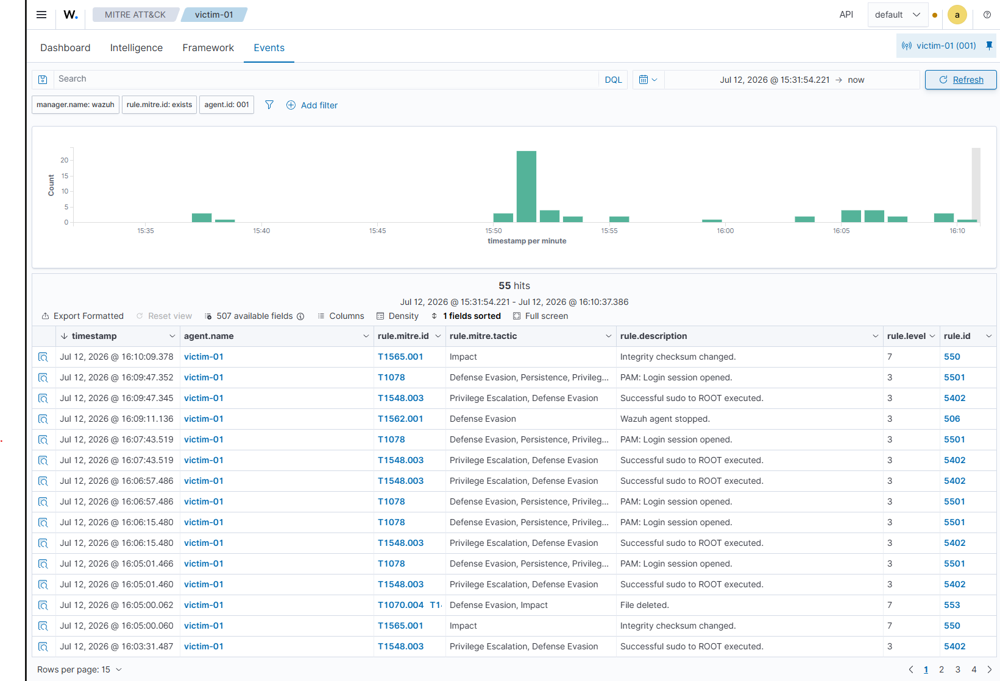

<a id="case-study-2-one-control-another-detection"></a>

## 🔁 Case study 2: one control, another detection

Atomic test `T1082-3` writes operating-system information to `/tmp/T1082.txt`, reads it, and deletes it.

```powershell
Invoke-AtomicTest T1082 -TestNumbers 3
```

This test shared the same fast write-and-delete pattern as the first case. I re-ran it without adding another rule or changing the configuration again.

Wazuh produced a rule 550 event for `/tmp/T1082.txt` at `15:55:06`. One targeted control therefore addressed both open file-artifact gaps.

I did not add direct alerts for `uname`, `cat`, or `uptime`. Those utilities are common, and alerting on their names alone would create weak, noisy detections.

> **💡 Takeaway:** controlling a reusable *behavior* (fast write-and-delete in `/tmp`) closed two techniques at once — stronger than a filename-specific alert.

<a id="case-study-3-audit-based-custom-rule"></a>

## 🛠️ Case study 3: audit-based custom rule

### Test

Atomic test `T1082-8` runs `hostname`. It creates no file for FIM to observe.

```powershell
Invoke-AtomicTest T1082 -TestNumbers 8
```

### Build and diagnosis

I worked outward from the endpoint instead of changing Wazuh rules blindly.

1. Installed and enabled `auditd`.
2. Added an `execve` audit rule for `/usr/bin/hostname`.
3. Confirmed kernel events with `ausearch`.
4. Added Wazuh collection for `/var/log/audit/audit.log`.
5. Used `wazuh-logtest` to inspect decoding and rule selection.
6. Added local rule 100100 and restarted the manager.

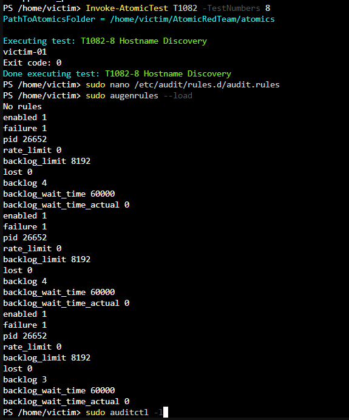

The kernel audit layer worked, and Wazuh decoded the event. The remaining issue was rule selection: generic audit rule 80700 matched at level 0 and did not generate an alert.

### Correlation rule

I added rule 100100 under `/var/ossec/etc/rules/local_rules.xml`, inheriting from rule 80700 and matching Wazuh's decoded `audit.execve.a0` field.

```xml
<group name="local,audit,t1082,discovery,">
  <rule id="100100" level="5">
    <if_sid>80700</if_sid>
    <field name="audit.execve.a0">hostname</field>
    <description>T1082 - System Information Discovery: hostname command executed (audit)</description>
    <mitre>
      <id>T1082</id>
    </mitre>
  </rule>
</group>
```

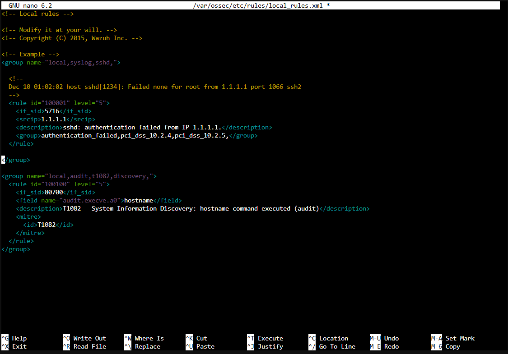

The deployable examples are:

- [`configs/auditd/t1082-hostname.rules`](configs/auditd/t1082-hostname.rules)
- [`configs/wazuh/agent-audit-log.xml`](configs/wazuh/agent-audit-log.xml)
- [`configs/wazuh/local_rules.xml`](configs/wazuh/local_rules.xml)

### Validation

I restarted `wazuh-manager`, re-ran test 8, and confirmed four rule 100100 alerts at level 5 with the expected description and T1082 mapping.

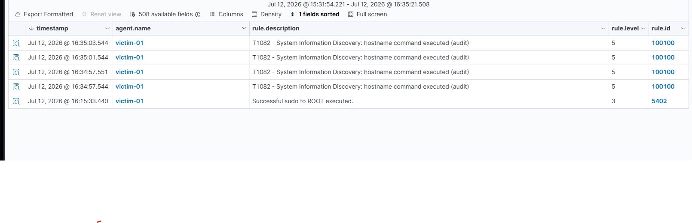

---

<a id="troubleshooting-highlights"></a>

## 🧯 Troubleshooting highlights

### Agent and manager version mismatch

The victim's Wazuh 4.14.6 agent would not enroll against the 4.9.2 manager. The agent log reported that its version must be lower than or equal to the manager version.

I took a Proxmox snapshot and upgraded the manager, indexer, dashboard, and Filebeat together to avoid internal component drift.

```bash
apt install --only-upgrade wazuh-manager wazuh-indexer wazuh-dashboard filebeat
```

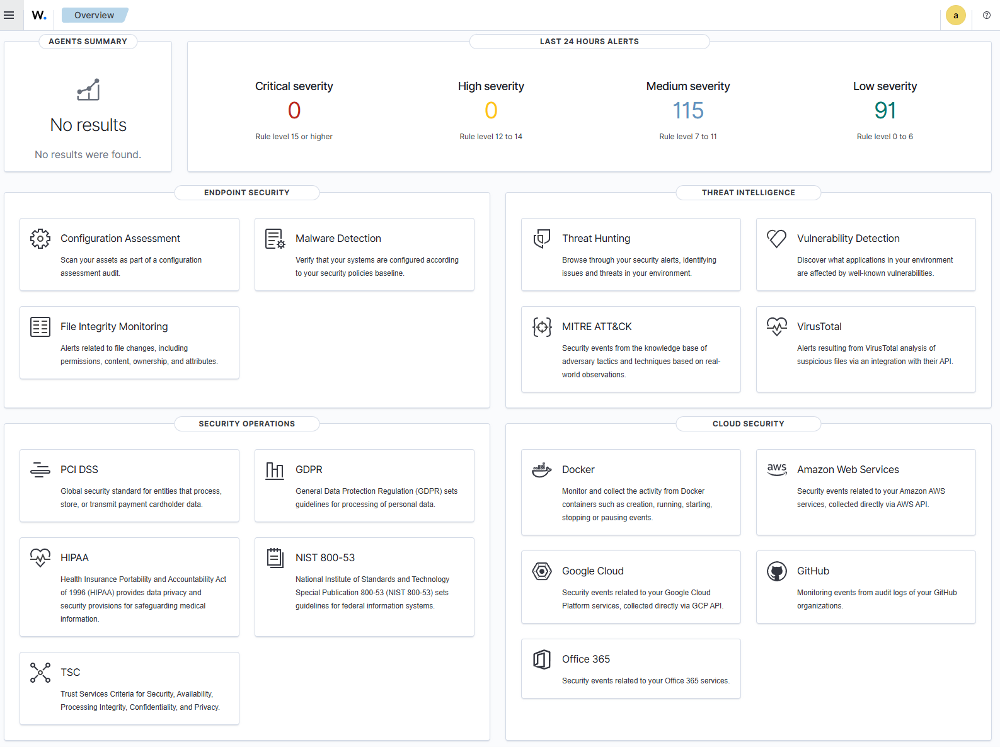

### Dashboard certificate mismatch after upgrade

The dashboard entered a restart loop after the upgrade. `journalctl` showed that the new configuration expected different certificate filenames.

I symlinked the existing certificates to the expected names, restarted the dashboard, and then confirmed the agent was active.

```bash
ln -s wazuh-dashboard-key.pem dashboard-key.pem
ln -s wazuh-dashboard.pem dashboard.pem
```

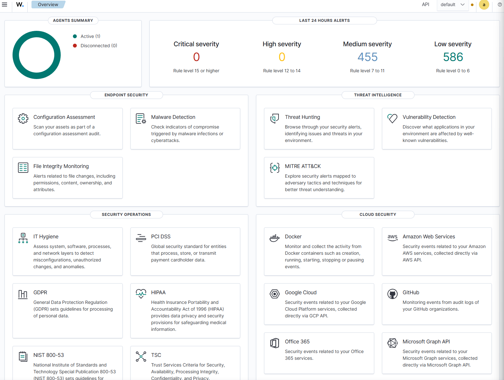

### Time and search-context mistakes

UTC agent logs, an unset victim timezone, and the dashboard's local display made a working FIM change appear older than the test.

I corrected the timezone and NTP state, then used the endpoint FIM panel instead of relying on a broad Threat Hunting text search.

```bash
sudo timedatectl set-timezone America/New_York
sudo timedatectl set-ntp true
```

### Thin provisioning versus real usage

Proxmox warned that virtual disk allocation exceeded reported free capacity. `lvs` showed only about 29% physical use, so I documented the risk and monitored it instead of making an unnecessary change.

### Local LLM constraints

The Ollama VM could not start with six vCPUs, so I reduced it to four. CPU-only model testing also showed that larger models were unsuitable for interactive use on this host.

Open WebUI exposed a separate tools-support error for `jimscard/whiterabbit-neo:13b`. I treat that UI compatibility issue separately from the CPU performance measurements in the full notes.

---

<a id="reproduce-the-controls"></a>

## ♻️ Reproduce the controls

Every fix is a small, reusable snippet under [`configs/`](configs/). The **[`configs/README.md`](configs/README.md)** guide is the single source for where each one belongs, plus a copy-paste **apply-and-validate** walkthrough that keeps the agent and manager steps separate.

| Artifact | Host | Purpose |
| --- | --- | --- |
| [`agent-fim.xml`](configs/wazuh/agent-fim.xml) | Wazuh agent | Real-time FIM for `/tmp` |
| [`agent-audit-log.xml`](configs/wazuh/agent-audit-log.xml) | Wazuh agent | Wazuh collection of `audit.log` |
| [`t1082-hostname.rules`](configs/auditd/t1082-hostname.rules) | Monitored host | Kernel audit rule for `hostname` |
| [`local_rules.xml`](configs/wazuh/local_rules.xml) | Wazuh manager | Custom Wazuh rule 100100 |

The two agent fragments **merge** into `ossec.conf`, the audit rule **drops in** as its own file under `/etc/audit/rules.d/`, and rule 100100 is **added** to the manager's `local_rules.xml`. These are focused examples, not full replacement configurations — merge them into your existing setup and validate in a lab before wider deployment.

## 🖼️ Evidence and full notes

The [full build notes](docs/full-build-notes.md) preserve the chronology that a summary cannot show: wrong turns, contradictory clues, commands, decisions, fixes, and remaining work.

Screenshot evidence is grouped by phase:

- [`docs/images/phase1-infrastructure/`](docs/images/phase1-infrastructure/)
- [`docs/images/phase2-detection-engineering/`](docs/images/phase2-detection-engineering/)

---

<a id="limitations"></a>

## ⚠️ Limitations

- This is a home-lab proof of concept, not a production deployment.
- Real-time monitoring of a busy `/tmp` directory can create noise and requires tuning.
- Rule 100100 was validated against the documented Atomic test and still needs long-term baselining.
- The screenshots capture one test session and do not replace exported events or automated regression tests.
- pfSense rule hardening and longer-term false-positive tuning remain open.

<a id="whats-next"></a>

## 🚀 What's next

- Add pfSense rules between the lab VLAN and management access.
- Baseline rule 100100 and tune noisy FIM activity.
- Test behavior that does not write to `/tmp`, including credential-access scenarios.
- Add Sigma versions of useful detections and compare them with Wazuh XML.
- Add repeatable validation scripts and sanitized sample events.
- Feed real Wazuh API output into the separate AI-assisted SOC project.

## 🔗 Related project

Infrastructure and network context lives in the [Home-Lab repository](https://github.com/BrandonRoos/Home-Lab).

---

<div align="center">

*Executive summary · paired with the chronological [full build notes](docs/full-build-notes.md) · part of [Home-Lab](https://github.com/BrandonRoos/Home-Lab)*

</div>
